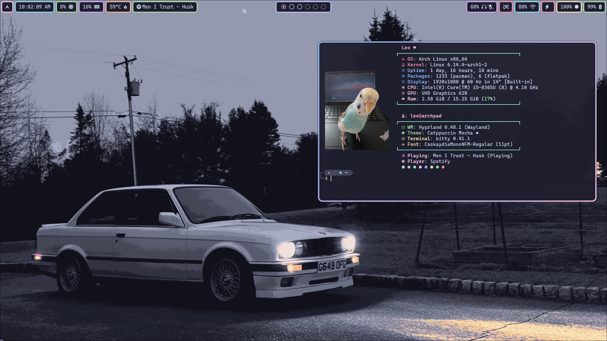

# hyprland-dotFiles
these are the dot files for my hyprland rice! if you have any questions feel more than free reach out however you want :)<br />

also if anybody ever decides to use anything from this lmk id love to see it!



## setup

> [!WARNING]
> check the keybinds in ~/.config/hypr/kebinds.conf, many might be set to function keys that your keyboard might not have!

move everything inside of the `config/` folder into your local `~/.config/`, as well as put the entire `scripts/` folder going into `~/Documents/` <br />

if you want the scripts folder somewhere else, youll have to edit the configs to match. <br />

there is also a one color pink version of the waybar config, just rename `~/.config/waybar/style.css` to something else and rename `stylePink.css` to `style.css`

## packages

when it comes to dependancies, I havent tested if this is everything needed, there could be a few missing, but heres everything i can think of. also please dont just copy paste these, if you dont want something, dont install it! this is just what i use. <br />

pacman:
```
hyprland hypridle hyprlock waybar foot btop swww rofi imagemagick power-profiles-daemon wl-clipboard grim slurp networkmanager pulseaudio mako libnotify
```
and aur:
```
rofi-bluetooth-git light ttf-jetbrains-mono-nerd ttf-cascadia-mono-nerd
```
note if your brightness keys dont work, you need to allow "light" to run without sudo:
```
sudo chmod +s /usr/bin/light
```
also for the notification client you have to apply the config
```
mako --config ~/.config/mako/config
```
programs i recommend (you can install alternatives, just note youll have to edit the configs accordingly)
```
kitty
dolphin
firefox
zed
spotify (i recommend spicetify to make pretty)
vesktop (discord client)
steam
fish shell
```

## themes for programs i use
[vencord/vesktop catppuccin](https://www.google.com/search?client=firefox-b-1-d&q=catppuccin+discord)<br />
[kitty catppuccin](https://github.com/catppuccin/kitty)<br />
[grub catppuccin](https://github.com/catppuccin/grub)<br />
[sddm astronaut theme](https://github.com/Keyitdev/sddm-astronaut-theme)<br />
[steam gtk/catppuccin](https://github.com/tkashkin/Adwaita-for-Steam)<br />
[fish shell tide theme](https://github.com/IlanCosman/tide)<br />
[firefox catppuccin](https://addons.mozilla.org/en-US/firefox/addon/catppuccin/)<br />

[and many catppuccin custom styles for websites](https://github.com/catppuccin/userstyles)
