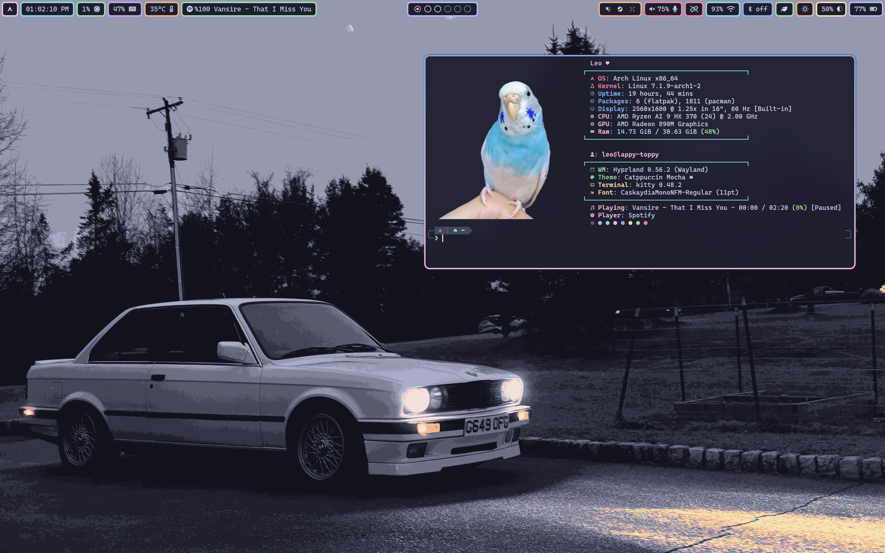

# hyprland-dotFiles
these are the dot files for my hyprland rice! if you have any questions feel more than free reach out however you want :)<br />

also if anybody ever decides to use anything from this lmk id love to see it!



## setup

> [!WARNING]
> check the keybinds in ~/.config/hypr/kebinds.conf, many might be set to function keys that your keyboard might not have!
> also, many of these scripts are just useful tools for me! feel free to just remove any you dont want.

### Method 1: link files

If you want to be able to run git pull to fetch any updates I make, do it this way.

Put this repo anywhere you prefer, then link everything in `config/` to be in your `~/.config/` folder with `ln -s ./config/<folder> ~/.config/<folder>`

Also, link the `scripts/` folder into your `~/Documents/` folder and `wallpapers/` into `~/.local/share/`
then any modifications you want to make have to be done by creating a `custom.lua` and/or `custom_append.lua` file in `~/.config/hypr/`

the `custom.lua` file gets imported before applying changes, so you can modify anything in the imported scripts with that.

anything else you want to do can be with `custom_append.lua`, which gets run after everything.

same story with custom.jsonc for waybar

NOTE: this feature is mostly just intended for me so I can use my config across computers, so sorry you can only modify hyprland. if you want me to change that feel free to reach out!

### Method 2: just copy em

either move everything inside of the `config/` folder into your local `~/.config/`, as well as put the entire `scripts/` folder going into `~/Documents/` <br />

if you want the scripts folder somewhere else, youll have to edit the configs/scripts to match. <br />

there is also a one color pink version of the waybar config, just rename `~/.config/waybar/style.css` to something else and rename `stylePink.css` to `style.css` <br />

generally id recommend putting the wallpapers in ~/.local/share/wallpapers but you can put them anywhere, just change the path in scripts/wallpaper.sh. also credit to the wallpapers in the orangci folder to [this repo](https://github.com/orangci/walls-catppuccin-mocha)

## packages

when it comes to dependancies, I havent tested if this is everything needed, there could be a few missing, but heres everything i can think of. also please dont just copy paste these, if you dont want something, dont install it! this is just what i use. (some stuff may be missing, lmk if I forgot something)<br />

pacman:
```
hyprland hypridle hyprlock hyprsunset hyprpicker waybar foot btop swww rofi imagemagick power-profiles-daemon brightnessctl wl-clipboard grim slurp networkmanager pulseaudio mako libnotify python-gobject usbutils
```
and aur:
```
rofi-bluetooth-git ttf-jetbrains-mono-nerd ttf-cascadia-mono-nerd grimblast-git
```
also for the notification client you have to apply the config
```
mako --config ~/.config/mako/config
```
programs i recommend (you can install alternatives, just note youll have to edit the configs accordingly)
```
kitty
dolphin
firefox
neovim
code
spotify (i recommend spicetify to make pretty)
vesktop (discord client)
steam
fish shell
```

## themes for programs i use
[vencord/vesktop catppuccin](https://www.google.com/search?client=firefox-b-1-d&q=catppuccin+discord)<br />
[kitty catppuccin](https://github.com/catppuccin/kitty)<br />
[grub catppuccin](https://github.com/catppuccin/grub)<br />
[sddm astronaut theme](https://github.com/Keyitdev/sddm-astronaut-theme)<br />
[steam gtk/catppuccin](https://github.com/tkashkin/Adwaita-for-Steam)<br />
[fish shell tide theme](https://github.com/IlanCosman/tide)<br />
[firefox catppuccin](https://addons.mozilla.org/en-US/firefox/addon/catppuccin/)<br />

[and many catppuccin custom styles for websites](https://github.com/catppuccin/userstyles)
